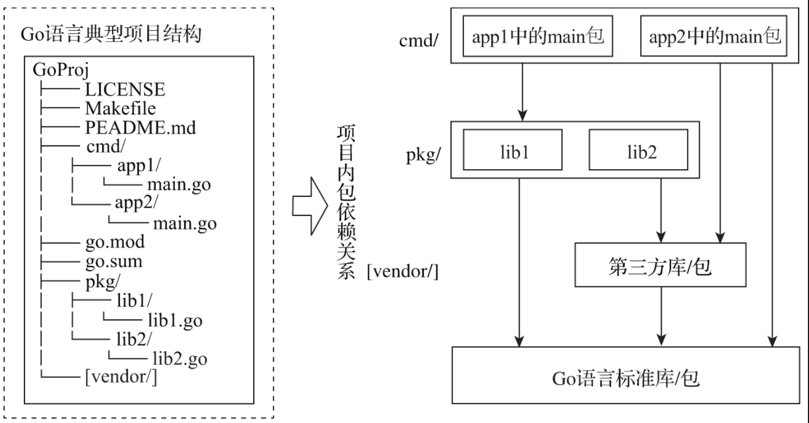

# GO语言典型项目结构

## 1. 典型项目结构

go语言的一个**典型项目结构**如下图:



上图就是一个支持构建二进制可执行文件的典型go项目结构,各目录如下:

1. cmd目录:
   1. 存放项目要构建的可执行文件对应的main包的源文件。如果有多个可执行文件需要构建，则将每个可执行文件的main包单独放在一个子目录中，比如图中的app1、app2
   2. 我们会在main包中做一些命令行参数解析、资源初始化、日志设施初始化、数据库连接初始化等工作，之后就会将程序的执行权限交给更高级的执行控制对象
2. pkg目录: 存放项目自身要使用并且同样也是可执行文件对应main包要依赖的库文件。该目录下的包可以被外部项目引用，算是项目导出包的一个聚合
3. go.mod和go.sum: go语言包依赖管理使用的配置文件.Go 1.16版本中，Go module成为默认的依赖包管理和构建机制。因此对于新的Go项目，建议基于Go module进行包依赖管理
4. internal目录: 对于不想暴露给外部引用，仅限项目内部使用的包，最简单的方式就是在顶层加入一个internal目录，将不想暴露到外部的包都放在该目录下.
   1. 举例如下:internal目录下的ilib1、ilib2可以被以GoLibProj目录为根目录的其他目录下的代码（比如lib.go、lib1/lib1.go等）所导入和使用，但是却不可以为GoLibProj目录以外的代码所使用，从而实现选择性地暴露API包
   2. 当然internal也可以放在项目结构中的任一目录层级中，关键是项目结构设计人员明确哪些要暴露到外层代码，哪些仅用于**同级目录或子目录**中。

```plaintext
// 带internal的Go库项目结构

$tree -F ./chapter2/sources/GoLibProj
GoLibProj
├── LICENSE
├── Makefile
├── README.md
├── go.mod
├── internal/
│  ├── ilib1/
│  └── ilib2/
├── lib.go
├── lib1/
│  └── lib1.go
└── lib2/
      └── lib2.go
```

## 2. go代码风格

1. gofmt工具: 格式化代码风格
2. goimports: goimports在gofmt功能的基础上增加了对包导入列表的维护功能，可根据源码的最新变动自动从导入包列表中增删包
3. 以上功能都集成在在主流IDE中, vscode, goland等, 无需深入了解

## 3. Go程序构建过程

### 3.1 包结构

Go语言是使用包（package）作为基本单元来组织源码的，可以说一个Go程序就是由一些包链接在一起构建而成的.

Go语言中包的定义和使用十分简单。通过package关键字声明Go源文件所属的包：

```go
// xx.go
package a
...
```

**没有循环依赖:** Go要求每个源文件在开头处显式地列出所有依赖的包导入，这样Go编译器不必读取和处理整个文件就可以确定其依赖的包列表。Go要求包之间不能存在循环依赖，这样一个包的依赖关系便形成了一张有向无环图。由于无环，包可以被单独编译，也可以并行编译。

**导入包时只需要读取包的目标文件,里面已经包含了包的依赖包: **已编译的Go包对应的目标文件（file_name.o或package_name.a）中不仅记录了该包本身的导出符号信息，还记录了其所依赖包的导出符号信息。这样，Go编译器在编译某包P时，针对P依赖的每个包导入（比如导入包Q），只需读取一个目标文件即可（比如：Q包编译成的目标文件中已经包含Q包的依赖包的导出信息），而无须再读取其他文件中的信息

### 3.2 go程序构建过程

和主流静态编译型语言一样，Go程序的构建简单来讲也是由编译（compile）和链接（link）两个阶段组成的

一个非main包在编译后会对应生成一个.a文件，该文件可以理解为Go包的目标文件，该目标文件实际上是通过pack工具（$GOROOT/pkg/tool/darwin_amd64/pack）对.o文件打包后形成的。默认情况下，在编译过程中.a文件生成在临时目录下，除非使用go install安装到$GOPATH/pkg下（Go 1.11版本之前），否则你看不到.a文件。如果是构建可执行程序，那么.a文件会在构建可执行程序的链接阶段起使用。

问题: 构建Go程序时，编译器会重新编译依赖包的源文件还是直接链接包的.a文件呢?

在使用第三方包的时候，在第三方包源码存在且对应的.a已安装的情况下，编译器链接的仍是根据第三方包最新源码编译出的.a文件，而不是之前已经安装到$GOPATH/pkg/darwin_amd64下的目标文件. 我们临时删除pkg1源码目录，但保留之前已经安装到$GOPATH/pkg/darwin_amd64下的pkg1.a文件。再来编译一下app1：我们看到Go编译器报错！Go编译器还是尝试去找pkg1包的源码，而不是直接链接已经安装的pkg1.a。

**构建过程**

1. 建立临时工作路径，命名为WORK，以后的编译、链接均以$WORK为当前工作目录
2. 编译app1的依赖包pkg1，将目标文件打包后放入$WORK/github.com/bigwhite/effective-go-book/chapter3-demo1/pkg/pkg1.a
3. 编译app1的main包，将目标文件打包后放入$WORK/github.com/bigwhite/effective-go-book/chapter3-demo1/cmd/app1.a
4. 链接器将app1.a、pkg1.a链接成$WORK/github.com/bigwhite/effective-go-book/chapter3-demo1/cmd/app1/_obj/exe/a.out；
5. 将a.out改名为app1（这个app1在执行go build命令的目录中）。

到这里我们明白了所谓的使用第三方包源码，实际上是链接了以该最新包源码编译的、存放在临时目录下的包的.a文件而已

**默认情况下对于标准库中的包，编译器直接链接的是$GOROOT/pkg/darwin_amd64下的.a文件。**

## 4. 包的导入

通过前面的实验，我们了解到编译器在编译过程中必然要使用的是编译单元（一个包）所依赖的包的源码。而编译器要找到依赖包的源码文件，就需要知道依赖包的源码路径。这个路径由两部分组成：基础搜索路径和包导入路径。

### 4.1 基础路径

1. 所有包（无论是标准库包还是第三方包）的源码基础搜索路径都包括$GOROOT/src
2. 只在module缓存的目录下搜索包的源码:$GOPATH/pkg/mod。

### 4.2 包导入路径

1. 搜索路径的第二部分就是位于每个包源码文件头部的包导入路径
2. 基础搜索路径与包导入路径结合在一起，Go编译器便可确定一个包的所有依赖包的源码路径的集合，这个集合构成了Go编译器的源码搜索路径空间

示例:

```go
// p1.go

package p1

import (
    "fmt"
    "time"
    "github.com/bigwhite/effective-go-book"
    "golang.org/x/text"
    "a/b/c"
    "./e/f/g"
)
...
```

源码搜索路径集合:

```go
- $GOROOT/src/fmt/
- $GOROOT/src/time/
- $GOROOT/src/github.com/bigwhite/effective-go-book/
- $GOROOT/src/golang.org/x/text/
- $GOROOT/src/a/b/c/
- $GOPATH/src/github.com/bigwhite/effective-go-book/
- $GOPATH/src/golang.org/x/text/
- $GOPATH/src/a/b/c/
- $CWD/e/f/g
```

1. 最后一个包导入路径“./e/f/g”是一个本地相对路径，它的基础搜索路径是$CWD，即执行编译命令时的当前工作目录。Go编译器在编译源码时会使用-D选项设置当前工作目录，该工作目录与“./e/f/g”的本地相对路径结合，便构成了一个源码搜索路径
2. 这里，我们已经给出了前面问题的答案：源文件头部的包导入语句import后面的部分就是一个路径，路径的最后一个分段也不是包名. 不过Go语言有一个惯用法，那就是包导入路径的最后一段目录名最好与包名一致
3. pkg1包导入路径的最后一段目录名为pkg1，而包名也是pkg1。也就是说上面代码中出现的两个pkg1虽然书写上是一模一样的，但代表的含义完全不同：**包导入路径上的pkg1表示的是一个目录名，而main函数体中的pkg1则是包名, 用package声明的包名, 每一个.go文件都有所属的package**

```go
// app1/main.go
package main

import (
    "github.com/bigwhite/effective-go-book/chapter3-demo1/pkg/pkg1"
)

func main() {
    pkg1.Func1()
}
```

4. 关于包导入，Go语言还有一个惯用法：当包名与包导入路径中的最后一个目录名不同时，最好用下面的语法将包名显式放入包导入语句

### 4.3 包名冲突

同一个包名在不同的项目、不同的仓库下可能都会存在。

也就是说同一个源码文件在其包导入路径构成源码搜索路径空间下很可能存在同名包

编译时会报错, 包名重复声明了

解决方法: 同一个包名在不同的项目、不同的仓库下可能都会存在。同一个源码文件在其包导入路径构成源码搜索路径空间下很可能存在同名包

```go
package main

import (
        pkg1 "github.com/bigwhite/effective-go-book/chapter3-demo1/pkg/pkg1"
        mypkg1 "github.com/bigwhite/effective-go-book/chapter3-demo2/pkg/pkg1"
)

func main() {
        pkg1.Func1()
        mypkg1.Func1()
}
```

### 5. 代码块和作用域

Go语言中的代码块是包裹在一对大括号内部的声明和语句，且代码块支持嵌套。如果一对大括号之间没有任何语句，那么称这个代码块为空代码块

代码块是代码执行流流转的基本单元，代码执行流总是从一个代码块跳到另一个代码块

Go语言中有两类代码块:

1. 一类是我们在代码中直观可见的由一堆大括号包裹的显式代码块，比如函数的函数体、for循环的循环体、if语句的某个分支等
2. 另一类则是没有大括号包裹的隐式代码块。Go规范定义了如下几种隐式代码块
   1. 宇宙（Universe）代码块：所有Go源码都在该隐式代码块中，就相当于所有Go代码的最外层都存在一对大括号
   2. 包代码块：每个包都有一个包代码块，其中放置着该包的所有Go源码
   3. 文件代码块：每个文件都有一个文件代码块，其中包含着该文件中的所有Go源码
   4. 每个if、for和switch语句均被视为位于其自己的隐式代码块中。相当于是在整个语句的外层有一个{}
   5. switch或select语句中的每个子句都被视为一个隐式代码块

Go标识符的作用域是基于代码块定义的，作用域规则描述了标识符在哪些代码块中是有效的

1. Go标识符的作用域是基于代码块定义的，作用域规则描述了标识符在哪些代码块中是有效的
2. 顶层（任何函数之外）声明的常量、类型、变量或函数（但不是方法）对应的标识符的作用域范围是包代码块。比如：包级变量、包级常量的标识符的作用域都是包代码块
3. Go源文件中导入的包名称的作用域范围是文件代码块。
4. 方法接收器（receiver）、函数参数或返回值变量对应的标识符的作用域范围是函数体（显式代码块），虽然它们并没有被函数体的大括号所显式包裹。
5. 在函数内部声明的常量或变量对应的标识符的作用域范围始于常量或变量声明语句的末尾，止于其最里面的那个包含块的末尾。
6. 在函数内部声明的类型标识符的作用域范围始于类型定义中的标识符，止于其最里面的那个包含块的末尾. 也就是类型符外层的第一层

#### 5.1 if代码块

1. 单if型

```go
func Foo() {
    if a := 1; true {
        fmt.Println(a)
    }
}
// 等价于
func Foo() {
    {
        a := 1
        if true {
            fmt.Println(a)
        }
    }
}
```

2. if{}else{}型

```go
func Foo() {
    if a,b := 1, 2; false{
        fmt.Println(a)
    } else {
        fmt.Println(b)
    }
}

// 等价于
func Foo() {
    {
        a, b := 1, 2
        if false {
            fmt.Println(a)
        } else {
            fmt.Println(b)
        }
    }
}
```

3. if {} else if {} else {} 型

```go
if SimpleStmt1; Expression1 {
    ...
} else if SimpleStmt2; Expression2 {
    ...
} else {
    ...
}

{ // 隐式代码块1开始
    SimpleStmt1

    if Expression1 { // 显式代码块1开始
        ...
    } else { // 显式代码块1结束；显式代码块2开始
        {  // 隐式代码块2开始
            SimpleStmt2

            if Expression2 { // 显式代码块3开始
                ...
            } else { // 显式代码块3结束；显式代码块4开始
                ...
            } // 显式代码块4结束
        } // 隐式代码块2结束
    } // 显式代码块2结束
} // 隐式代码块1结束

```

#### 5.2 for语句

for语句有两种形式

1. 通用形式
2. for range型

```go
// 1.
for InitStmt; Condition; PostStmt {
    ...
}

// 2.
for IndentifierList := range Expression {
    ...
}

// 或

for ExpressionList = range Expression {
   ...
}
```

转换:InitStmt中声明的变量的作用域涵盖了Condition、PostStmt和for的显式代码块

```go
{ // 隐式代码块开始
    InitStmt
    for Condition; PostStmt {
        // for显式代码块
        ...
    }
} // 隐式代码块结束
```

#### 5.3 switch-case

```go
switch SimpleStmt; Expression {
    case ExpressionList1:
        ...
    case ExpressionList2:
        ...
    default:
        ...
}

// 等价于
{ // 隐式代码块1开始
    SimpleStmt
    switch Expression { // 显式代码块1开始
        case ExpressionList1:
        { // 隐式代码块2开始
            ...
        } // 隐式代码块2结束
        case ExpressionList2:
        { // 隐式代码块3开始
            ...
        } // 隐式代码块3结束
        default:
        { // 隐式代码块4开始
            ...
        } // 隐式代码块4结束
    } // 显式代码块1结束
} // 隐式代码块1结束
```

#### 5.4 select-case

和switch-case无法在case子句中声明变量不同的是，select-case可以在case字句中通过短变量声明定义新变量，但该变量依然被纳入case的隐式代码块中。

```go
select {
    case SendStmt:
        ...
    case RecvStmt:
        ...
    default:
        ...
}
// 等价于
select { // 显式代码块开始
    case SendStmt:
    { // 隐式代码块1开始
        ...
    } // 隐式代码块1结束
    case RecvStmt:
    { // 隐式代码块2开始，如果RecvStmt声明了新变量，那么该变量也应包含在隐式代码块2中
        ...
    } // 隐式代码块2结束
    default:
    { // 隐式代码块3开始
        ...
    } // 隐式代码块3结束
} // 显式代码块结束
```

示例:

```go
c1 := make(chan int)
c2 := make(chan int, 1)
c2 <- 11

select {
case c1 <- 1:
    fmt.Println("SendStmt case has been chosen")
case i := <-c2:
    _ = i
    fmt.Println("RecvStmt case has been chosen")
default:
    fmt.Println("default case has been chosen")
}
// 等价于
c1 := make(chan int)
c2 := make(chan int, 1)
c2 <- 11

select {
case c1 <- 1:
    {
        fmt.Println("SendStmt case has been chosen")
    }
case "如果该case被选择":
    {
        i := <-c2:
        _ = i
        fmt.Println("RecvStmt case has been chosen")
    }
default:
    {
        fmt.Println("default case has been chosen")
    }
}
```

## 6. for循环

### 6.1 快乐路径

Go语言惯用的“快乐路径”原则。所谓“快乐路径”即成功逻辑的代码执行路径，这个原则要求：

1. 当出现错误时，快速返回；
2. 成功逻辑不要嵌入if-else语句中；
3. “快乐路径”的执行逻辑在代码布局上始终靠左，这样读者可以一眼看到该函数的正常逻辑流程；“
4. 快乐路径”的返回值一般在函数最后一行，
5. 如果你的函数实现代码不符合“快乐路径”原则，可以按下面的步骤进行重构：
6. 尝试将“正常逻辑”提取出来，放到“快乐路径”中；如果无法做到上一点，很可能是函数内的逻辑过于复杂，可以将深度缩进到if-else语句中的代码析出到一个函数中，再对原函数实施“快乐路径”原则的重构。

### 6.2 for range避坑

1. 迭代变量的重用: for range的惯用法是使用短变量声明方式（:=）在for的initStmt中声明迭代变量（iteration variable）。但需要注意的是，这些迭代变量在for range的每次循环中都会被重用，而不是重新声明. 由块作用域规则可以得出这个结论
2. 注意参与迭代的是range表达式的副本. Go中的数组在内部表示为连续的字节序列，虽然长度是Go数组类型的一部分，但长度并不包含在数组类型在Go运行时的内部表示中，数组长度是由编译器在编译期计算出来。这个例子中，对range表达式的复制即对一个数组的复制，a'则是Go临时分配的连续字节序列，与a完全不是一块内存区域。因此无论a被如何修改，其参与循环的副本a'依旧保持原值，因此v从a'中取出的仍旧是a的原值，而非修改后的值
3. 使用指针时复制的是结构体指针,不是原始的数组, 因此可以修改原来的数组
4. 切片与数组还有一个不同点，就是其len在运行时可以被改变，而数组的长度可认为是一个常量，不可改变. 在range切片时,如果对原始切片进行append, 不会改变当前的range表达式的副本
5. range表达式的复制行为还会带来一些性能上的消耗，尤其是当range表达式的类型为数组时，range需要复制整个数组；而当range表达式类型为数组指针或切片时，这个消耗将小得多，因为仅仅需要复制一个指针或一个切片的内部表示（一个结构体）即可。map, channel的迭代也适用
6. channel:对于channel来说，channel在Go运行时内部表示为一个channel描述符的指针
   1. 对于channel来说，channel在Go运行时内部表示为一个channel描述符的指针

```go
// chapter3/sources/control_structure_idiom_5.go
func recvFromUnbufferedChannel() {
    var c = make(chan int)

    go func() {
        time.Sleep(time.Second * 3)
        c <- 1
        c <- 2
        c <- 3
        close(c)
    }()

    for v := range c {
        fmt.Println(v)
    }
}
```

### 6.3 break

Go语言规范中明确规定break语句（不接label的情况下）结束执行并跳出的是同一函数内break语句所在的最内层的for、switch或select的执行

Go语言规范中明确规定break语句（不接label的情况下）结束执行并跳出的是同一函数内break语句所在的最内层的for、switch或select的执行

带label的continue和break提升了Go语言的表达能力，可以让程序轻松拥有从深层循环中终止外层循环或跳转到外层循环继续执行的能力，使得Gopher无须为类似的逻辑设计复杂的程序结构或使用goto语句

示例: label可以认为主要是和for循环一起用,解决深层循环退出的问题

```go
outerLoop:
    for i := 0; i < n; i++ {
        // ...
        for j := 0; j < m; j++ {
            // 当不满足某些条件时，直接终止最外层循环的执行
            break outerLoop

            // 当满足某些条件时，直接跳出内层循环，回到外层循环继续执行
            continue outerLoop
        }
    }
```

### 6.4 尽量用case表达式列表替代fallthrough

switch-case语句默认是不“fall through”的，需要fall through的时候，可以使用关键字fallthrough显式实现。

不过在实际编码过程中，fallthrough的应用依然不多，而且Go的switch-case语句还提供了case表达式列表来支持多个分支表达式处理逻辑相同的情况

```go
switch n {
case 1: fallthrough
case 3: fallthrough
case 5: fallthrough
case 7:
    odd()
case 2: fallthrough
case 4: fallthrough
case 6: fallthrough
case 8:
    even()
default:
    unknown()
}

// vs.

switch n {
case 1, 3, 5, 7:
    odd()
case 2, 4, 6, 8:
    even()
default:
    unknown()
}
```

outerLoop:
    for i := 0; i < n; i++ {
        // ...
        for j := 0; j < m; j++ {
            // 当不满足某些条件时，直接终止最外层循环的执行
            break outerLoop

    // 当满足某些条件时，直接跳出内层循环，回到外层循环继续执行
            continue outerLoop
        }
    }
