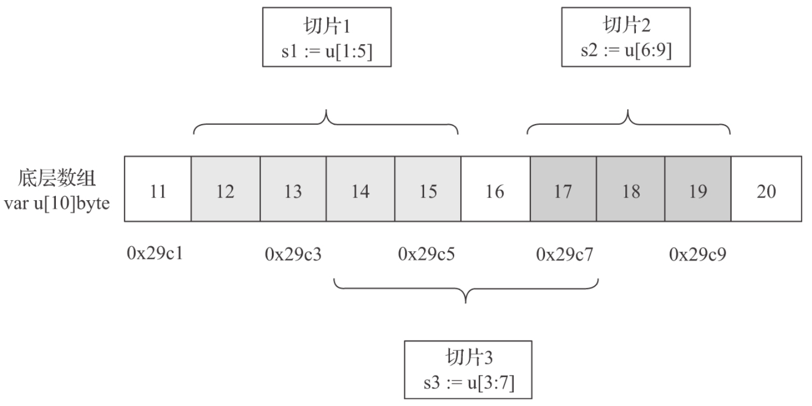
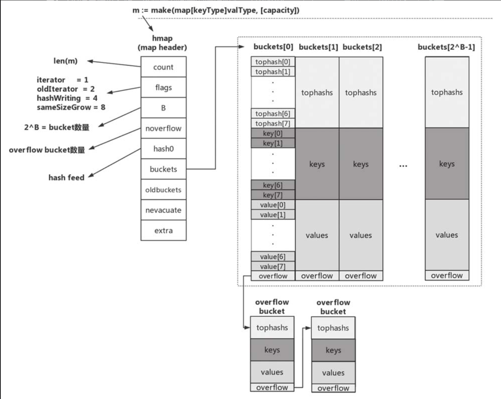
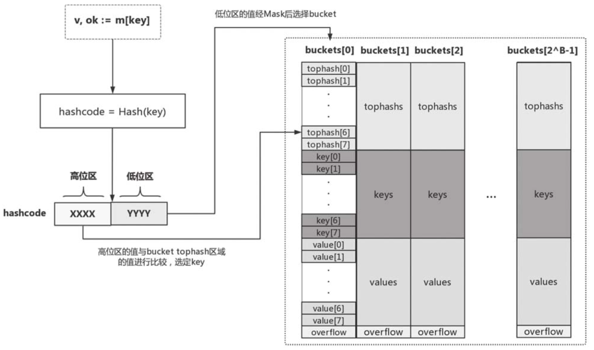

# 数据结构

## 1. 切片

### 1.1 数组

Go语言数组是一个固定长度的、容纳同构类型元素的连续序列，因此Go数组类型具有两个属性：元素类型和数组长度

Go数组是值语义的，这意味着一个数组变量表示的是整个数组，这点与C语言完全不同。在C语言中，数组变量可视为指向数组第一个元素的指针。而在Go语言中传递数组是纯粹的值拷贝，对于元素类型长度较大或元素个数较多的数组，如果直接以数组类型参数传递到函数中会有不小的性能损耗。这时很多人会使用数组指针类型来定义函数参数，然后将数组地址传进函数，这样做的确可以避免性能损耗，但这是C语言的惯用法，在Go语言中，更地道的方式是使用切片.

### 1.2 切片

切片之于数组就像是文件描述符之于文件。在Go语言中，数组更多是“退居幕后”，承担的是底层存储空间的角色；而切片则走向“前台”，为底层的存储（数组）打开了一个访问的“窗口”



因此，我们可以称切片是数组的“描述符”。切片之所以能在函数参数传递时避免较大性能损耗，是因为它是“描述符”的特性，切片这个描述符是固定大小的，无论底层的数组元素类型有多大，切片打开的窗口有多长.

```go
//$GOROOT/src/runtime/slice.go
type slice struct {
    array unsafe.Pointer
    len   int
    cap   int
}
```

1. array：指向下层数组某元素的指针，该元素也是切片的起始元素
2. len：切片的长度，即切片中当前元素的个数
3. cap：切片的最大容量，cap >= len

在运行时中，每个切片变量都是一个runtime.slice结构体类型的实例

示例:

```go
s := make([]byte, 5)
```

1. 可以通过语法u[low: high]创建对已存在数组进行操作的切片，这被称为数组的切片化（slicing)
2. 还可以通过语法s[low: high]基于已有切片创建新的切片，这被称为切片的reslicing
3. 新创建的切片与原切片同样是共享底层数组的，并且通过新切片对数组的修改也会反映到原切片中。

切片可以动态扩容, 功能与python的列表一致

扩充方式是每次增加一倍

## 2. map

无序的键值对: key-vlaue

map对value的类型没有限制，但是对key的类型有严格要求：key的类型应该严格定义了作为“==”和“!=”两个操作符的操作数时的行为，因此函数、map、切片不能作为map的key类型

map类型不支持“零值可用”，未显式赋初值的map类型变量的零值为nil。对处于零值状态的map变量进行操作将会导致运行时panic：

```go
var m map[string]int // m = nil
m["key"] = 1         // panic: assignment to entry in nil map
```

必须对map类型变量进行显式初始化后才能使用它。和切片一样，创建map类型变量有两种方式：一种是使用复合字面值，另一种是使用make这个预声明的内置函数

1. 复合字面值创建

```go
// $GOROOT/src/net/status.go
var statusText = map[int]string{
    StatusOK:                   "OK",
    StatusCreated:              "Created",
    StatusAccepted:             "Accepted",
    ...
}
```

2. 使用make创建map类型变量

```go
// $GOROOT/src/net/client.go
icookies = make(map[string][]*Cookie)

// $GOROOT/src/net/h2_bundle.go
http2commonLowerHeader = make(map[string]string, len(common))
```

和切片一样，map也是引用类型，将map类型变量作为函数参数传入不会有很大的性能损耗，并且在函数内部对map变量的修改在函数外部也是可见的

### 2.1 map的基本操作

1. 插入数据: 如果key已经存在于map中，则该插入操作会用新值覆盖旧值

```go
m := make(map[K]V)
m[k1] = v1
m[k2] = v2
m[k3] = v3
```

2. 获取数据个数

```go
m := map[string]int {
    "key1" : 1,
    "key2" : 2,
}

fmt.Println(len(m)) // 2
m["key3"] = 3
fmt.Println(len(m)) // 3
```

3. 查找和数据读取: 我们需要通过ok的值来判定key是否存在于map中。只有当ok =true时，所获得的value值才是我们所需要的. 因为如果键不存在时获取,会返回零值. 此时无法判断零值是不存在还是键对应的值

```go
_, ok := m["key"]
if !ok {
    // "key"不在map中
}

m := map[string]int

v, ok := m["key"]
if !ok {
    // "key"不在map中
}
fmt.Println(v)
```

4. 删除数据: 借助内置函数delete, 即便要删除的数据在map中不存在，delete也不会导致panic。

```go
m := map[string]int {
    "key1" : 1,
    "key2" : 2,
}

fmt.Println(m) // map[key1:1 key2:2]
delete(m, "key2")
fmt.Println(m) // map[key1:1]
```

5. 遍历数据: for range, 无序输出

```go
// chapter3/sources/map_iterate.go
func main() {
    m := map[int]int{
        1: 11,
        2: 12,
        3: 13,
    }

    fmt.Printf("{ ")
    for k, v := range m {
        fmt.Printf("[%d, %d] ", k, v)
    }
    fmt.Printf("}\n")
}

$ go run map_iterate.go
{ [1, 11] [2, 12] [3, 13] }
```

### 2.2 map的内部实现

Go运行时使用一张哈希表来实现抽象的map类型。

运行时实现了map操作的所有功能，包括查找、插入、删除、遍历等。

在编译阶段，Go编译器会将语法层面的map操作重写成运行时对应的函数调用

```go
// $GOROOT/src/cmd/compile/internal/gc/walk.go
// $GOROOT/src/runtime/map.go

m := make(map[keyType]valType, capacityhint) → m := runtime.makemap(maptype, capacityhint, m)
v := m["key"]      → v := runtime.mapaccess1(maptype, m, "key")
v, ok := m["key"]  → v, ok := runtime.mapaccess2(maptype, m, "key")
m["key"] = "value" → v := runtime.mapassign(maptype, m, "key") // v是用于后续存储value 的空间的地址
delete(m, "key")   → runtime.mapdelete(maptype, m, "key")
```

与语法层面map类型变量一一对应的是runtime.hmap类型的实例。hmap是map类型的header，可以理解为map类型的描述符，它存储了后续map类型操作所需的所有信息。

真正用来存储键值对数据的是bucket（桶），每个bucket中存储的是Hash值低bit位数值相同的元素，默认的元素个数为BUCKETSIZE, 值为8

当某个bucket（比如buckets[0]）的8个空槽（slot）都已填满且map尚未达到扩容条件时，运行时会建立overflow bucket，并将该overflow bucket挂在上面bucket（如buckets[0]）末尾的overflow指针上，这样两个bucket形成了一个链表结构，该结构的存在将持续到下一次map扩容




1. count：当前map中的元素个数；对map类型变量运用len内置函数时，len函数返回的就是count这个值。
2. flags：当前map所处的状态标志，目前定义了4个状态值—iterator、oldIterator、hashWriting和sameSizeGrow。
3. B：B的值是bucket数量的以2为底的对数，即2^B = bucket数量。
4. noverflow：overflow bucket的大约数量。
5. hash0：哈希函数的种子值。
6. buckets：指向bucket数组的指针。
7. oldbuckets：在map扩容阶段指向前一个bucket数组的指针。
8. nevacuate：在map扩容阶段充当扩容进度计数器。所有下标号小于nevacuate的bucket都已经完成了数据排空和迁移操作。
9. extra：可选字段。如果有overflow bucket存在，且key、value都因不包含指针而被内联（inline）的情况下，该字段将存储所有指向overflow bucket的指针，保证overflow bucket是始终可用的（不被垃圾回收掉）。
10. 每个bucket由三部分组成：tophash区域、key存储区域和value存储区域
    1. tophash: 当向map插入一条数据或从map按key查询数据的时候，运行时会使用哈希函数对key做哈希运算并获得一个哈希值hashcode。这个hashcode非常关键，运行时将hashcode“一分为二”地看待，其中低位区的值用于选定bucket，高位区的值用于在某个bucket中确定key的位置

       
    2. 因此，每个bucket的tophash区域是用于快速定位key位置的，这样避免了逐个key进行比较这种代价较大的操作，尤其是当key是size较大的字符串类型时，这是一种以空间换时间的思路
    3. key存储区域: tophash区域下面是一块连续的内存区域，存储的是该bucket承载的所有key数据。运行时在分配bucket时需要知道key的大小。那么运行时是如何知道key的大小的呢？当我们声明一个map类型变量时，比如var m map[string]int，Go运行时就会为该变量对应的特定map类型生成一个runtime.maptype实例（如存在，则复用

       ```go
       // $GOROOT/src/runtime/type.go
       type maptype struct {
           typ        _type
           key        *_type
           elem       *_type
           bucket     *_type // 表示hash bucket的内部类型
           keysize    uint8  // key的大小
           elemsize   uint8  // elem的大小
           bucketsize uint16 // bucket的大小
           flags      uint32
       }
       ```

       该实例包含了我们所需的map类型的所有元信息。前面提到过编译器会将语法层面的map操作重写成运行时对应的函数调用，这些运行时函数有一个共同的特点：第一个参数都是maptype指针类型的参数。Go运行时就是利用maptype参数中的信息确定key的类型和大小的，map所用的hash函数也存放在maptype.key.alg.hash(key, hmap.hash0)中。同时maptype的存在也让Go中所有map类型共享一套运行时map操作函数，而无须像C++那样为每种map类型创建一套map操作函数，从而减少了对最终二进制文件空间的占用
    4. value存储区域: key存储区域下方是另一块连续的内存区域，该区域存储的是key对应的value。和key一样，该区域的创建也得到了maptype中信息的帮助。Go运行时采用了将key和value分开存储而不是采用一个kv接着一个kv的kv紧邻方式存储，这带来的是算法上的复杂性，但却减少了因内存对齐带来的内存浪费
    5. 另外还有一点要提及的是，如果key或value的数据长度大于一定数值，那么运行时不会在bucket中直接存储数据，而是会存储key或value数据的指针。目前Go运行时定义的最大key和value的长度分别如下：

       ```go
       // $GOROOT/src/runtime/map.go
       const (
           maxKeySize  = 128
           maxElemSize = 128
       )
       ```
11. map扩容
    1. Go运行时的map实现中引入了一个LoadFactor（负载因子），当count > LoadFactor * 2^B或overflow bucket过多时，运行时会对map进行扩容。目前LoadFactor设置为6.5
    2. 如果是因为overflow bucket过多导致的“扩容”，实际上运行时会新建一个和现有规模一样的bucket数组，然后在进行assign和delete操作时进行排空和迁移；
    3. 如果是因为当前数据数量超出LoadFactor指定的水位的情况，那么运行时会建立一个两倍于现有规模的bucket数组，但真正的排空和迁移工作也是在进行assign和delete操作时逐步进行的。原bucket数组会挂在hmap的oldbuckets指针下面，直到原buckets数组中所有数据都迁移到新数组，原buckets数组才会被释放
12. map与并发
    1. 从上面的实现原理来看，充当map描述符角色的hmap实例自身是有状态的（hmap.flags）且对状态的读写是没有并发保护的，因此map实例不是并发写安全的，不支持并发读写。如果对map实例进行并发读写，程序运行时会发生panic
    2. Go 1.9版本中引入了支持并发写安全的sync.Map类型，可以用来在并发读写的场景下替换掉map。另外考虑到map可以自动扩容，map中数据元素的value位置可能在这一过程中发生变化，因此Go不允许获取map中value的地址，这个约束是在编译期间就生效的

## 3. string

1. string类型的数据是不可变的
2. 零值可用
3. 获取长度的时间复杂度是O(1)级别
4. 支持通过+/+=操作符进行字符串连接
5. 支持各种比较关系操作符：==、!= 、>=、<=、>和<
6. Go字符串的每个字符都是一个Unicode字符，并且这些Unicode字符是以UTF-8编码格式存储在内存当中的
7. 原生支持多行字符串

### 3.1 内部表示

```go
// $GOROOT/src/runtime/string.go
type stringStruct struct {
    str unsafe.Pointer
    len int
}

// $GOROOT/src/runtime/string.go

func rawstring(size int) (s string, b []byte) {
    p := mallocgc(uintptr(size), nil, false)
    stringStructOf(&s).str = p
    stringStructOf(&s).len = size

    *(*slice)(unsafe.Pointer(&b)) = slice{p, size, size}

    return
}
```

### 3.2 高效构造

1. strings.Join:
2. strings.Builder.writeString

做了预初始化的strings.Builder连接构建字符串效率最高；

带有预初始化的bytes.Buffer和strings.Join这两种方法效率十分接近，分列二三位；

未做预初始化的strings.Builder、bytes.Buffer和操作符连接在第三档次；

fmt.Sprintf性能最差，排在末尾。
